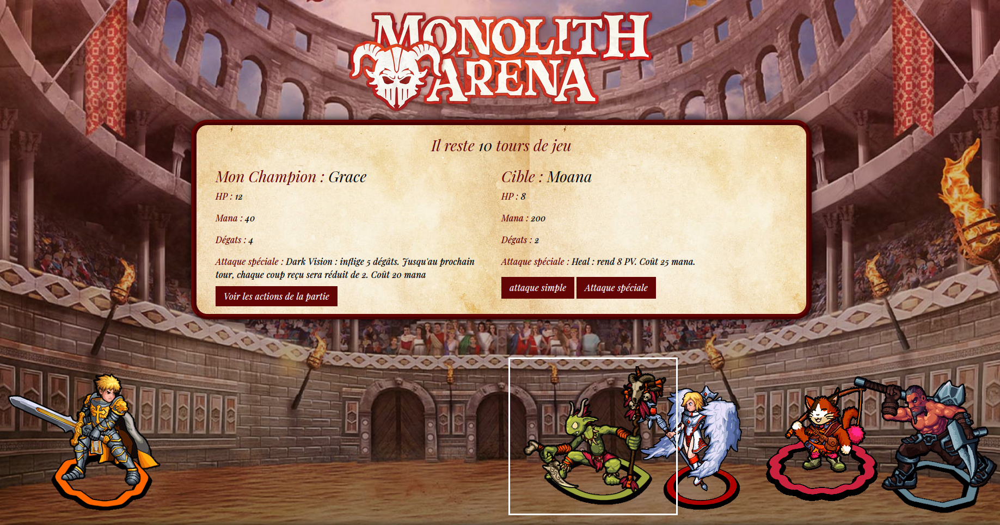

<h1 align="center">
   
  
   
MONOLITH ARENA   
</h1>
<h4 align="center">survival in the arena by defeating all your enemies! good luck champ!</h4>
 

## WEB version 🌐

Le site est en live ici 👉 [Monolith Arena](https://monolitharena.herokuapp.com/)

## Technologies utilisées ⚙️

Pour ce programme les technologies suivantes ont été utilisé :  

 
 

## Crédit 🔗
[Guillaume Reygner](https://github.com/guillaume-rygn)

